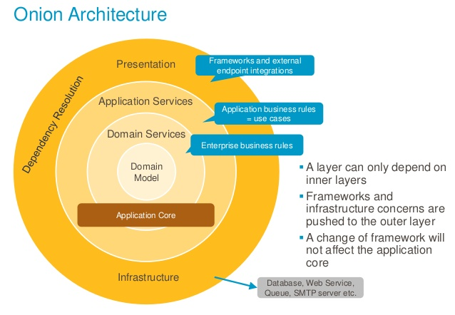

# NestJS Microservice API hanoi-coffee

[![node version][node-image]][node-url]

[node-image]: https://img.shields.io/badge/node.js-%3E=_18.0-green.svg?style=flat-square
[node-url]: http://nodejs.org/download/

A production-ready NestJS microservice boilerplate implementing Clean Architecture principles (Onion Architecture, DDD, and Ports & Adapters).


## 🚀 Quick Start

1. Copy `.env.example` to `.env` and configure your environment variables

2. Set up databases:

   - PostgreSQL: Create database `hanoi-coffee` in pgAdmin4
   - MongoDB: Set up replica set:

   ```bash
   # Start replica set nodes
   mongod --port 27081 --dbpath ~/data/db1 --replSet app --bind_ip localhost
   mongod --port 27082 --dbpath ~/data/db2 --replSet app --bind_ip localhost
   mongod --port 27083 --dbpath ~/data/db3 --replSet app --bind_ip localhost

   # Initialize replica set
   mongosh --port 27081
   rs.initiate({
     _id: "app",
     members: [
       { _id: 0, host: "localhost:27081" },
       { _id: 1, host: "localhost:27082" },
       { _id: 2, host: "localhost:27083" }
     ]
   })
   ```

3. Install and run:

   ```bash
   # Install dependencies
   yarn

   # Start infrastructure services
   yarn infra

   # Start development server
   yarn start:dev
   ```

## 🛠️ Development

### Available Scripts

```bash
# Development
yarn start:dev

# Debug mode
yarn start:debug

# Production
yarn start

# Build
yarn build

# Testing
yarn test
yarn test:cov

# Linting
yarn lint
yarn prettier

# Database Migrations
yarn migration-postgres:create
yarn migration-postgres:run
yarn migration-mongo:create
yarn migration-mongo:run
```

### CRUD Generator

Generate complete CRUD operations with:

```bash
yarn scaffold
```

Choose from:

- `POSTGRES:CRUD`
- `MONGO:CRUD`
- `LIB`
- `INFRA`
- `MODULE`
- `CORE`

#### Generated CRUD Features

- **List Operations**
  - Search functionality
  - Pagination
  - Sorting
  - Entity validation
- **Delete Operations**
  - Logical deletion
  - Entity validation
- **Update Operations**
  - Partial updates
  - Entity validation
- **Create Operations**
  - Entity validation
  - Duplicate prevention

## 🏗️ Architecture

This boilerplate implements:

- Clean Architecture (Onion Architecture)
- Domain-Driven Design (DDD)
- Ports and Adapters Pattern



[Learn more about Onion Architecture](https://jeffreypalermo.com/2008/07/the-onion-architecture-part-1/)

## 🔑 Key Features

- **Internationalization (i18n)**
- **Authentication & Authorization**
  - JWT-based auth
  - Role-based access control
  - Permission management
- **Database Support**
  - MongoDB with migrations
  - PostgreSQL with migrations
- **Caching**
  - Redis
  - In-memory cache
- **Observability**
  - Distributed tracing
  - Structured logging
  - Metrics
- **Developer Experience**
  - Lint-staged + Husky
  - Commitlint
  - 100% test coverage
  - Swagger documentation
- **Infrastructure**
  - Docker support
  - Secrets management
  - HTTP service layer
  - Generic repository pattern

## 👥 Contributors

[](https://github.com/mikemajesty)

## 📝 License

[MIT License](https://opensource.org/licenses/mit-license.php)
